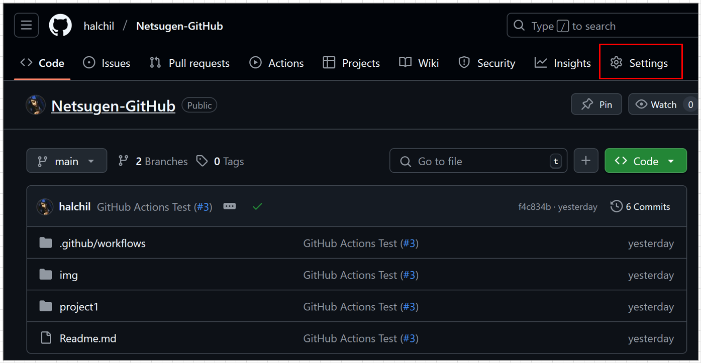
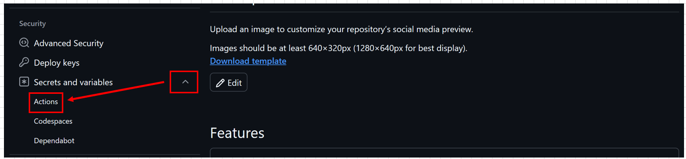
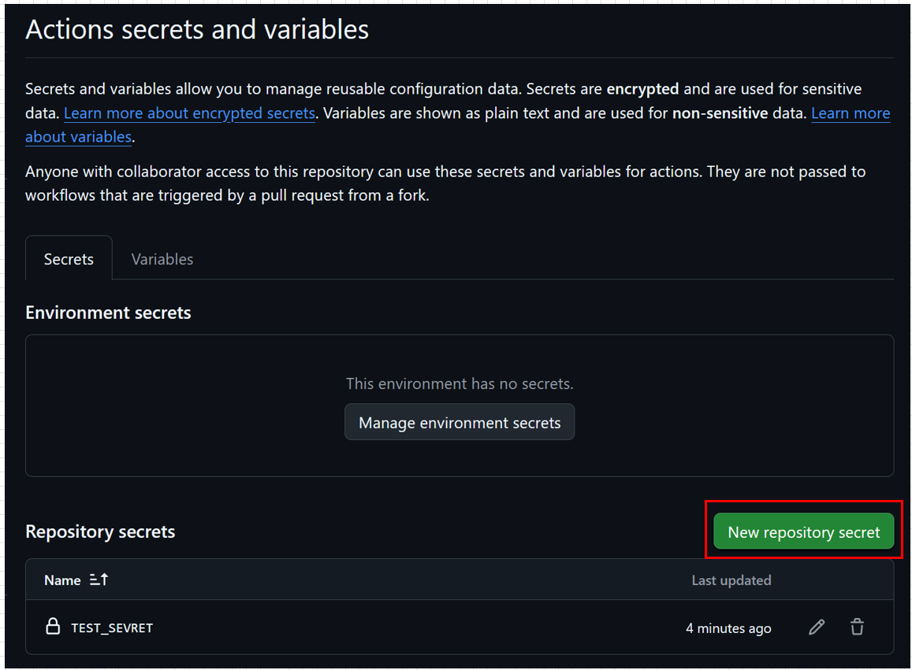
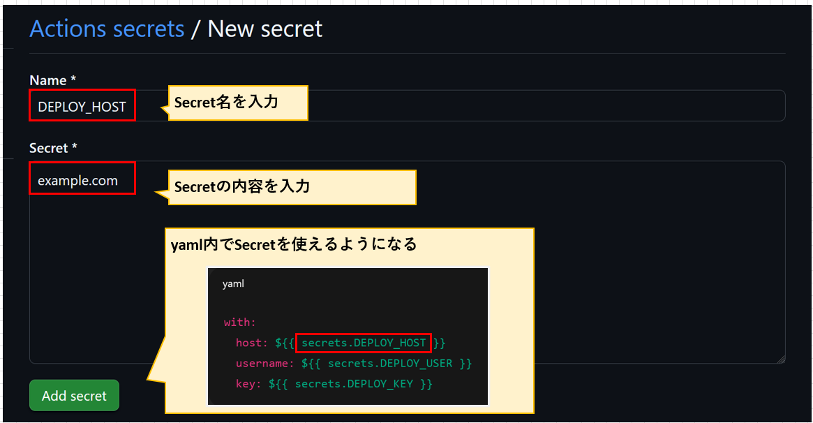

# Memo
パスワード認証方式と鍵認証方式の説明を行う。

# CI/CDについて

 CI/CDはソフトウェア開発の自動化プロセスを表す用語

## CI(Continuous Integration)＝継続的インテグレーション

開発者がコードを頻繁に(1日に何度も)統合し、そのたびに自動でビルドやテストを行う仕組み。
Gitにプッシュしたら、自動でユニットテストやLintが走るもの。

## CD(Continuous Delivery/Continuous Deployment)＝継続的デリバリー/継続的デプロイ

自動でステージングや本番リリース「直前」まで進める(最終的なデプロイは人の判断)

自動で本番用のパッケージが作られる
ステージング環境に自動デプロイされ、あとはボタン一つで本番反映

つまり、
正確には「CI＝統合＋テスト」「CD＝本番までの自動化レベルの違い」となる。


# CDの設定方法

## AWS上にEC2インスタンスを立ち上げる

AWS上にEC2インスタンスを立ち上げる。
その後、ローカルPCより鍵認証方式でログインを行う。(のちにGitHub Secretに秘密鍵情報を記載するため)


接続情報
```
ユーザ名:ubuntu
パスワード:鍵認証方式のため設定無
```

```
[実行コマンド]
git version

[結果]
git version 2.43.0
```

## GitHubのSecretに接続情報を記載

以下のようにGitHubのSettingsからSecretの登録を行う。





今回行う設定は3つである。

```
[設定内容]
DEPLOY_HOST:AWS上のパブリックDNS
DEPLOY_USER:ubuntu
DEPLOY_KEY:EC2作成時の秘密鍵情報
```

これらを設定すると、CI/CDパイプラインのyamlファイル上で`secret.DEPLOY_HOST`のような変数名として呼び出し可能となる。

## CDパイプライン用のステップを記載


### 事前準備
デプロイするためのディレクトリを作成しておく

```
[実行コマンド]
sudo mkdir /var/www/myapp
```

CI/CDパイプラインにCD用の`deploy`ステップを追加。

[]

```
[実行コマンド]
ll /var/www/myapp/
total 8
drwxr-xr-x 2 root root 4096 Jun 28 06:31 ./
drwxr-xr-x 3 root root 4096 Jun 28 06:31 ../

```

ll /var/www/myapp/
total 12
drwxr-xr-x 3 ubuntu ubuntu 4096 Jun 28 07:06 ./
drwxr-xr-x 3 root   root   4096 Jun 28 06:31 ../
drwxrwxr-x 6 ubuntu ubuntu 4096 Jun 28 07:06 Netsugen-GitHub/

# トラブルシュート

`git clone`の権限が足りなかった。
```
[実行コマンド]
sudo chown -R ubuntu:ubuntu /var/www/myapp

ll /var/www/myapp/
total 8
drwxr-xr-x 2 ubuntu ubuntu 4096 Jun 28 06:31 ./
drwxr-xr-x 3 root   root   4096 Jun 28 06:31 ../
```

    プルリクを出した

    CD（デプロイ）ステップで失敗した

    CI/CD の GitHub Actions が "failed" 状態になっている

    修正せずに同じプルリクのまま、もう一回パイプラインを流したい

✅ 結論：プルリクをやり直さず、同じプルリクで再実行できる！
再実行する方法は2つ：

該当のプルリクを開く

下の「Checks」タブ（または「Actions」タブ）をクリック

失敗したワークフローを選ぶ

右上の「Re-run jobs」または「Re-run all jobs」ボタンを押す
=======
```

