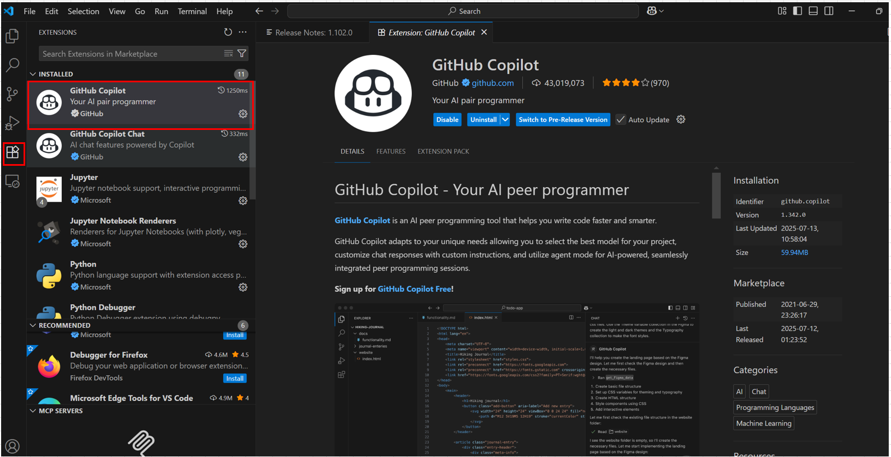
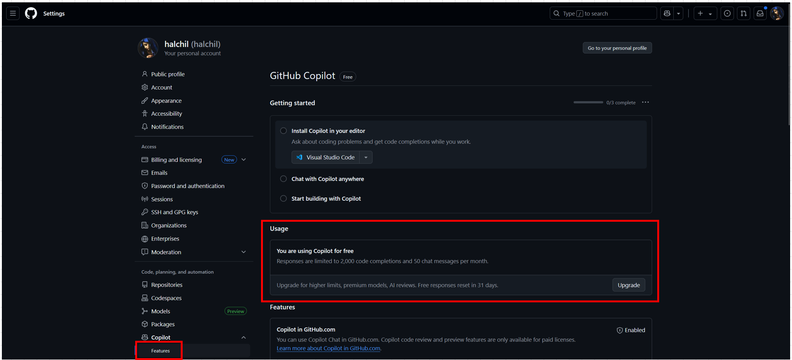

# はじめに

# 利用準備


## GitHub Copilotに登録

[GitHub Copilot Page](https://github.com/copilot)


## VS Codeに拡張機能をインストール



### VSCode現在の拡張機能のインストール状況確認
同様にExtensionタブから確認可能。


# GitHub Copilotの使い方

# 前提
VSCodeにGitHubユーザ情報が認識されている必要がある。

```
[実行コマンド]
git config --global user.name

[結果]
halchil


[実行コマンド]
git config --global user.email

[結果]
halzcreate1215@gmail.com
```

試しに、`test.js`ファイルを作成。
(言語はなんでもOK)
基本的な使い方は、以下の2点。

## ①コード補完
基本パターン

```
function greet(name) {
```
↑と入力して数秒待つと、灰色の文字で

```
  return "Hello, " + name;
```

と出る → Tabキーで確定

## コメントを書き、それに沿ったコードを書く

```
# フィボナッチ数列を返す
```

自動で関数生成されるので、Tabで確定。

```
# フィボナッチ数列を計算する関数
def fibonacci(n):
    if n <= 0:
        return []
    elif n == 1:
        return [0]
    elif n == 2:
        return [0, 1]
    
    fib_sequence = [0, 1]
    for i in range(2, n):
        next_value = fib_sequence[i - 1] + fib_sequence[i - 2]
        fib_sequence.append(next_value)
    
    return fib_sequence
# ユーザーからの入力を受け取る
n = int(input("フィボナッチ数列の項数を入力してください: "))
# フィボナッチ数列を計算して表示する
...
```


# 管理

## 登録状況の確認

